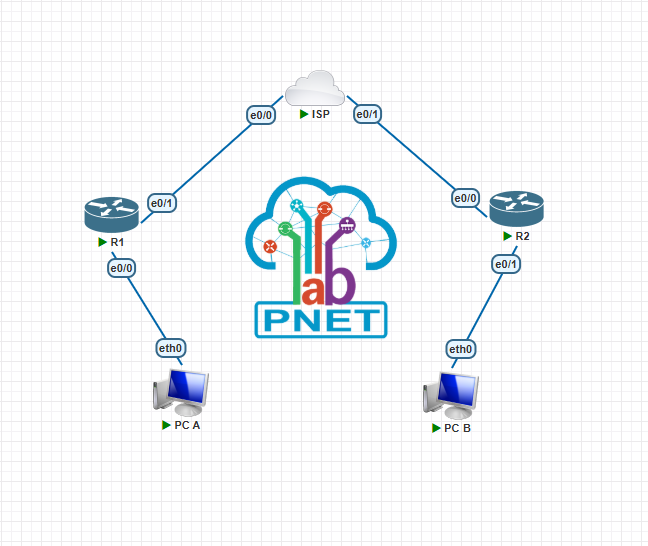
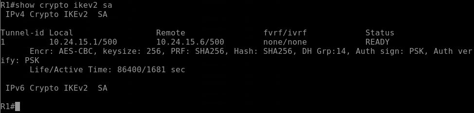
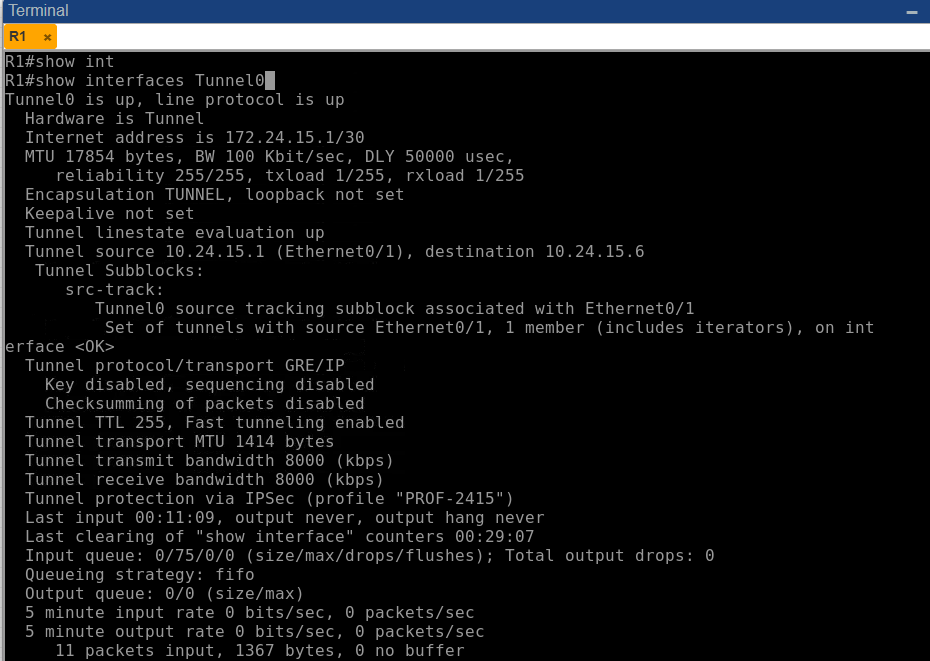
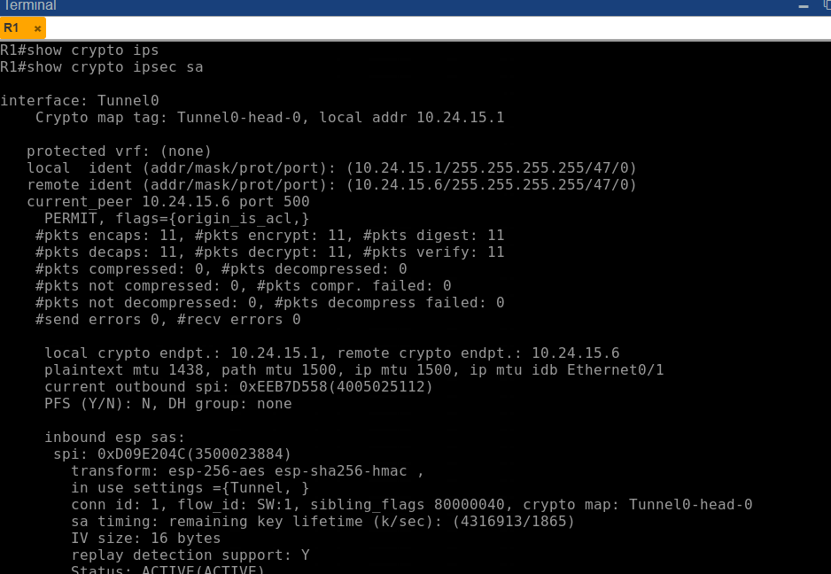
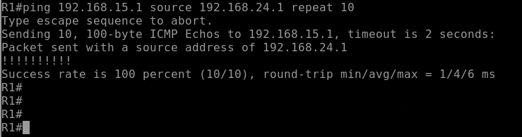

# VPN Site-to-Site IPSec IKEv2 Route-Based

**Estudiante:** Edwin De Paula  
**Matricula:** 2024-2415  
**Institución:** Instituto Tecnológico de las Américas (ITLA)  
**Asignatura:** Seguridad en Redes

---

## Video

| Recurso | URL |
|---|---|
| Video YouTube | https://youtu.be/AbfZVvSYWxA |

---

## Objetivo

Implementar una VPN Site-to-Site basada en enrutamiento utilizando IPSec con IKEv2 entre dos sitios remotos a través de un router ISP. En este lab se combina la flexibilidad de una interfaz de túnel virtual (Tunnel0) con la seguridad mejorada de IKEv2, donde el enrutamiento determina qué tráfico entra al túnel y el perfil IKEv2 se aplica directamente sobre el perfil IPSec de la interfaz.

---

## Topología



| Dispositivo | Interfaz | Dirección IP | Descripción |
|---|---|---|---|
| R1 | Ethernet0/0 | 192.168.24.1/24 | LAN Site A |
| R1 | Ethernet0/1 | 10.24.15.1/30 | WAN hacia ISP |
| R1 | Tunnel0 | 172.24.15.1/30 | Interfaz de túnel virtual |
| ISP | Ethernet0/0 | 10.24.15.2/30 | WAN hacia R1 |
| ISP | Ethernet0/1 | 10.24.15.5/30 | WAN hacia R2 |
| R2 | Ethernet0/0 | 10.24.15.6/30 | WAN hacia ISP |
| R2 | Ethernet0/1 | 192.168.15.1/24 | LAN Site B |
| R2 | Tunnel0 | 172.24.15.2/30 | Interfaz de túnel virtual |
| PC-A | eth0 | 192.168.24.10/24 | Gateway: 192.168.24.1 |
| PC-B | eth0 | 192.168.15.10/24 | Gateway: 192.168.15.1 |

---

## Parámetros de Configuración

### IKEv2 Proposal

| Parámetro | Valor |
|---|---|
| Nombre | PROP-2415 |
| Cifrado | AES-CBC-256 |
| Integridad | SHA-256 |
| Grupo Diffie-Hellman | Grupo 14 (2048 bits) |

### IKEv2 Keyring y Profile

| Parámetro | Valor |
|---|---|
| Keyring | KR-2415 |
| Pre-shared Key | Edwin2024 |
| Profile | IKEV2-PROF-2415 |
| Autenticación local | Pre-shared Key |
| Autenticación remota | Pre-shared Key |

### Fase 2 - IPSec

| Parámetro | Valor |
|---|---|
| Transform Set | TS-2415 |
| Protocolo | ESP |
| Cifrado | AES 256 |
| Integridad | SHA-256 HMAC |
| Modo | Tunnel |
| IPSec Profile | PROF-2415 |

### Tunnel0

| Parámetro | Valor |
|---|---|
| IP R1 | 172.24.15.1/30 |
| IP R2 | 172.24.15.2/30 |
| Tunnel Source R1 | Ethernet0/1 (10.24.15.1) |
| Tunnel Source R2 | Ethernet0/0 (10.24.15.6) |
| Tunnel Destination R1 | 10.24.15.6 |
| Tunnel Destination R2 | 10.24.15.1 |

---

## Explicación de la Configuración

### Diferencia clave con Lab 2 (IKEv1 Route-Based)

En el Lab 2 el perfil IPSec solo referenciaba el transform set. En este lab el perfil IPSec además referencia el perfil IKEv2 mediante `set ikev2-profile IKEV2-PROF-2415` — esto es lo que le indica al router que use IKEv2 para la negociación en lugar de IKEv1.

```
crypto ipsec profile PROF-2415
 set transform-set TS-2415
 set ikev2-profile IKEV2-PROF-2415   ← esta línea es la diferencia
```

### Diferencia clave con Lab 4 (IKEv2 Policy-Based)

En el Lab 4 el IKEv2 profile se vinculaba al crypto map con `set ikev2-profile`. En este lab no hay crypto map — el IKEv2 profile se vincula al IPSec profile, que a su vez se aplica sobre Tunnel0 con `tunnel protection`.

### Flujo de Negociación

1. PC-A genera tráfico hacia 192.168.15.0/24
2. R1 consulta la tabla de ruteo — apunta a Tunnel0 via 172.24.15.2
3. El tráfico entra a Tunnel0
4. Tunnel0 tiene `tunnel protection ipsec profile PROF-2415`
5. PROF-2415 referencia el IKEv2 profile — R1 inicia negociación IKEv2 con R2
6. Se establece la SA IKEv2 y el tráfico fluye cifrado

---

## Verificación

### IKEv2 SA

```
show crypto ikev2 sa
```



Estado `READY` con parámetros AES-CBC-256, SHA256, grupo DH 14 y PSK confirmados.

### Interfaz Tunnel0

```
show interfaces Tunnel0
```



`Tunnel0 is up/up` y `Tunnel protection via IPSec (profile "PROF-2415")` confirman que la interfaz virtual está activa con protección IKEv2.

### IPSec SA - Fase 2

```
show crypto ipsec sa
```



Contadores de paquetes cifrados y descifrados confirman el correcto procesamiento del tráfico. Status `ACTIVE(ACTIVE)` en ambas direcciones.

### Prueba de Conectividad

```
ping 192.168.15.1 source 192.168.24.1 repeat 10
```



100% de success rate confirma el correcto funcionamiento end-to-end de la VPN IKEv2 Route-Based.

---

## Archivos del Repositorio

```
ipsec-ikev2-route-based/
├── configs/
│   ├── R1.txt
│   ├── ISP.txt
│   └── R2.txt
├── docs/
│   └── screenshots/
│       ├── topology.png
│       ├── ikev2-sa.png
│       ├── tunnel-interface.png
│       ├── ipsec-sa.png
│       └── ping-test.png
└── README.md
```

---

## Herramientas Utilizadas

- PNetLab — Plataforma de emulación de red
- Cisco IOSv 15.4(2)T4 — Imagen de router emulado
- VMware — Virtualización del servidor PNetLab
